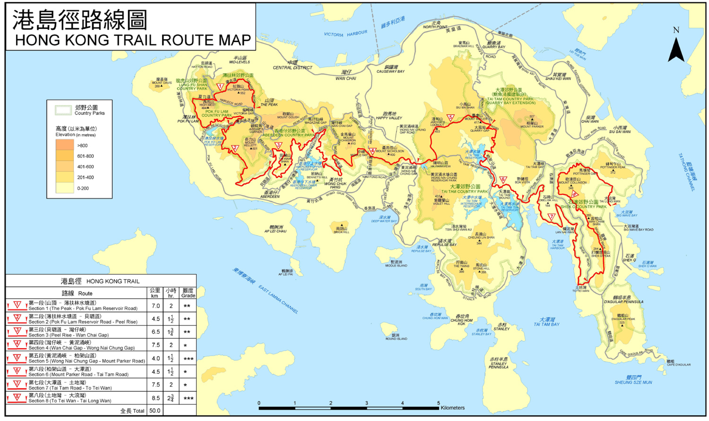

港岛径（英文：Hong Kong Trail）是位于香港香港岛的远足径，于1985年4月1日启用，全长50公里，共分为8段。起点位于山顶炉峰峡，而终点则为石澳大浪湾。每年绿色力量都举行绿色力量环岛行，为香港环境教育工作筹款。国际旅游指南《Lonely Planet》曾评选全球最佳城市远足径，港岛径入选头十大，获得第十名。

#####第一段

- 路线  
    山顶 ― 薄扶林水塘
- 长度  
    7.0 km
- 时间  
    2 h
- 难度  
    \*
- 简介  
    要数香港最经典的风景，非从太平山顶俯瞰的维多利亚港莫属。除了明信片常见的凉亭景致，山径起步处的卢吉道视野更广阔开扬。这条百年环山路径以香港第14任总督卢吉爵士命名，建于1913至1914年间，部分山径以栈道形式建成，可看到日出和夜景，春天更可拍摄到雾锁香江的奇幻景象。它所属的炉峰自然步道亦有非常茂密的林木包围，山壁长满苔藓，4至5月假苹婆绽开粉红小花，7至10月则有白楸的白色小花装饰山径，加上古旧石椅和街灯，是山顶游客区难得一见的古逸雅致。沿步道绕至太平山西南面的夏力道，然后漫步于薄扶林水塘的植林中，从繁忙的金融都会跳接上港岛西部的民生气息。香港故事，不只有一种想象。

#####第二段

- 路线  
    薄扶林水塘 ― 贝璐道
- 长度  
    4.5 km
- 时间  
    1.5 h
- 难度  
    \*
- 简介  
    港岛径第二站从香港第一座储水库薄扶林水塘起步，水库于1863年竣工，并在14年后完成扩建工程以应付港岛居民需要。当地水源充沛，加上集水区的次生林和河流营造的生态环境，吸引了不少林鸟和昆虫进驻，包括白眉鸫、夜鹭、海南蓝仙鹟等，春夏之间特别有生气。沿路除了车路和小径，还有一条让马匹踱步缓跑的驰马径，附近还有凉亭和长椅等设施，作为休息站最好不过。驰马径尽头有一个观景台，可一览香港仔以至南丫岛一带的水色风光。港岛径第二段结束前会下降至田湾一带，山径与大厦非常靠近，城郊只在一线之间，这就是香港郊野的特色。终点前听见的淙淙流水声来自姜花涧，这里曾发现本地原生物种―濒危的短脚角蟾。

#####第三段

- 路线  
    贝璐道 ― 湾仔峡
- 长度  
    6.5 km
- 时间  
    1.75 h
- 难度  
    \*
- 简介  
    香港不少道路都记载了这个地方的历史，山径起点的贝璐道就以殖民时代第18任港督命名。港岛径第三段以奇力山流出姜花涧为起点，虽然初段要爬斜坡，但在夏季大雨过后，很快就会看到由姜花涧形成的小瀑布，精神为之一振！然后便是由巨木撑起的林荫泥径，平坦易走，两旁更可发现不同品种的蕨类及苔藓类植物。在山中穿梭一段后，就会在丛林间瞥见1930年代建成的香港仔上下水塘。其中下水塘曾为大成纸厂的私人水塘，早在1890年兴建，及后被政府收购并加建为公用水塘以解决港岛西区食水问题。而上水塘以花岗岩建成的水坝、受意大利文艺复兴风格影响设计的水掣房，以及拱形石桥都被列为法定古迹，是行山人士最喜爱的拍照地点。

#####第四段

- 路线  
    湾仔峡 ― 黄泥涌峡
- 长度  
    7.5 km
- 时间  
    2 h
- 难度  
    \**
- 简介  
    香港的山林除了是一本植物百科全书，也是一本历史故事书。港岛径第四段由第17任港督金文泰爵士夫人命名的金夫人驰马径作起点，穿过香港仔水塘的林荫路，沿路会发现不同品种的昆虫与雀鸟，走至湾仔峡有两条精致的英式古桥，沿路是鸭脚木、白楸、梭罗树，还有芳香的牙香树等本土原生树木。香树顾名思义来自其木材的香气，曾经是重要的出口木材，香港据说是因为出口香木而得名。成熟的次生林以及香港仔水塘带来的充沛水源，吸引了不同鸟类停留或栖居，观鸟者会在这里寻找紫啸鸫、画眉、黑领噪鹛、叉尾太阳鸟的踪影。终点的黄泥涌峡，是二战时港岛战役最重要的一个战场，留下不少军事遗迹。

#####第五段

- 路线  
    黄泥涌峡 ― 柏架山道
- 长度  
    4.0 km
- 时间  
    1.5 h
- 难度  
    \***
- 简介  
    山径起点为黄泥涌水塘，竣工于1899年，为1894年瘟疫后改善食水卫生的措施之一。水库最初是作为大潭水塘群以外的辅助水源，1960年代后有多座大型水塘落成，黄泥涌水塘的重要性因而大减。水塘的水坝、水掣房及水塘溢流口皆已列为法定古迹，值得细赏。港岛径第五段只有4公里，上落幅度却十分大，不过正因为大起大落，远足人士才可以先后登上位于港岛中央超过400米高的渣甸山顶及毕拿山顶，前者可由近至远一览维多利亚港至九龙半岛的繁华商业地带，后者则有南丫岛、大潭湾及赤柱的港岛南部风光，可说是港岛最佳「观景台」。山径很公平，有上有落，终点前还有599级下坡的天梯。想挑战这条山径，记得准备充足体力和意志力！

#####第六段

- 路线  
    柏架山道 ― 大潭道
- 长度  
    4.5 km
- 时间  
    1.5 h
- 难度  
    \*
- 简介  
    港岛径第六段的起点位于海拔300多米高的大风坳，沿着柏架山道走，多得生长在两旁的高大树木，巨大的树冠伸延至行道上，绿林成荫，为游人遮挡阳光，让人感到一阵清凉，就像一条天然的「冷气走廊」。走至大潭上水塘主坝，优美的水塘风光映入眼帘，湛蓝的水塘映衬四周葱郁的山野，令人心旷神怡；而落成超过100年、别具维多利亚时代建筑特色的主坝及石桥，美轮美奂，同样是值得大家细心欣赏。

#####第七段

- 路线  
    大潭道 ― 土地湾
- 长度  
    7.5 km
- 时间  
    2 h
- 难度  
    \**
- 简介  
    港岛径第七段几乎是港岛径全程中最容易走的一段。开段大树处处，但在这段路上走了一会儿后，景观却是愈来愈开扬，到大潭东引水道起点时，沿引水道向前一直走，大潭湾及红山半岛的美景便在眼前慢慢展现。俯瞰大潭湾，水色清澈，周末有不少人到此畅玩水上活动，点缀着宁静的大潭湾，更可远眺壮丽的赤柱半岛景色。走在第七段的末段，烂泥湾村的风光向你呈现，眼下的海边村屋虽然破旧，仍不妨停下脚步，怀想昔日纯朴、与世无争的渔村生活。虽然整段路径近乎围绕山腰而行，难度不高，但当离开引水道后，接近末段时，路面却愈加陡峭，首先向下走数十米，继而向上走至百多米，为这路段平添一点挑战性和趣味！

#####第八段

- 路线  
    土地湾 ― 大浪湾
- 长度  
    8.5 km
- 时间  
    2.75 h
- 难度  
    \***
- 简介  
    香港岛四面环海，从高处远眺，海岸线尽收眼帘。港岛径第八段是港岛径各段中最长的一段，当中所覆盖的龙脊曾获外国杂志选为「亚洲最佳市区远足径」，因此沿路上不时人来人往。这段路的起点位于海拔百多米，起步后需上行约200米，按指示牌到达284米高的打烂埕顶山山顶。由打烂埕顶山至云枕山的一段连绵山脉，状如腾飞的巨龙骨脊般高低起伏，因而有「龙脊」之称；到了位于最高点的观景台，更可尽览石澳、东龙岛、赤柱及大潭的景色。踏进云枕山山腰的林荫小径内，静心倾听林间树声簌簌和鸟叫虫鸣，定能感受到大自然赐予的安谧舒适。续走哥连臣山的林道，可欣赏到柴湾一带甚至对岸将军澳的景致。到达马塘坳后下坡，即可到达港岛径的终点大浪湾！

######相关链接

- [漁農自然護理署｜郊野樂行](https://www.hiking.gov.hk/)
- [地理資訊地圖（GeoInfo Map）](https://www.map.gov.hk/)
- [綠洲Oasistrek｜香港行山路線](https://www.oasistrek.com/)
- [香港旅遊發展局](https://www.discoverhongkong.com/)