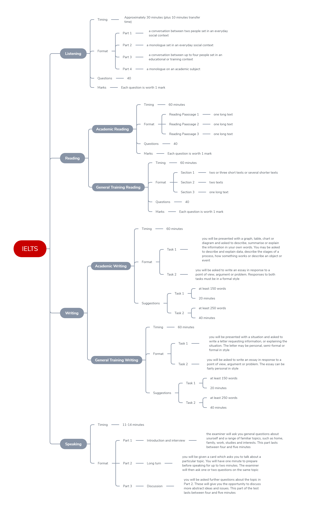

###Listening

#####Timing

Approximately 30 minutes (plus 10 minutes transfer time)

#####Format

- __Part 1__  
a conversation between two people set in an everyday social context
- __Part 2__  
a monologue set in an everyday social context
- __Part 3__  
a conversation between up to four people set in an educational or training context
- __Part 4__  
a monologue on an academic subject

#####Questions

40

#####Marks

Each question is worth 1 mark

###Reading

####Academic Reading

#####Timing

60 minutes

#####Format

- __Reading Paassage 1__  
one long text
- __Reading Paassage 2__  
one long text
- __Reading Paassage 3__  
one long text

#####Questions

40

#####Marks

Each question is worth 1 mark

####General Training Reading

#####Timing

60 minutes

#####Format

- __Section 1__  
two or three short texts or several shorter texts
- __Section 2__  
two texts
- __Section 3__  
one long text

#####Questions

40

#####Marks

Each question is worth 1 mark

###Writing

####Academic Writing

#####Timing

60 minutes

#####Format

- __Task 1__  
you will be presented with a graph, table, chart or diagram and asked to describe, summarise or explain the information in your own words. You may be asked to describe and explain data, describe the stages of a process, how something works or describe an object or event
- __Task 2__  
you will be asked to write an essay in response to a point of view, argument or problem. Responses to both tasks must be in a formal style

#####Suggestions

- __Task 1__  
  - at least 150 words
  - 20 minutes
- __Task 2__  
  - at least 250 words
  - 40 minutes

####General Training Writing

#####Timing

60 minutes

#####Format

- __Task 1__  
you will be presented with a situation and asked to write a letter requesting information, or explaining the situation. The letter may be personal, semi-formal or formal in style
- __Task 2__  
you will be asked to write an essay in response to a point of view, argument or problem. The essay can be fairly personal in style

#####Suggestions

- __Task 1__  
  - at least 150 words
  - 20 minutes
- __Task 2__  
  - at least 250 words
  - 40 minutes

###Speaking

#####Timing

11-14 minutes

#####Format

- __Part 1__  
__Introduction and interview__  
the examiner will ask you general questions about yourself and a range of familiar topics, such as home, family, work, studies and interests. This part lasts between four and five minutes
- __Part 2__  
__Long turn__  
you will be given a card which asks you to talk about a particular topic. You will have one minute to prepare before speaking for up to two minutes. The examiner will then ask one or two questions on the same topic
- __Part 3__  
__Discussion__  
you will be asked further questions about the topic in Part 2. These will give you the opportunity to discuss more abstract ideas and issues. This part of the test lasts between four and five minutes

