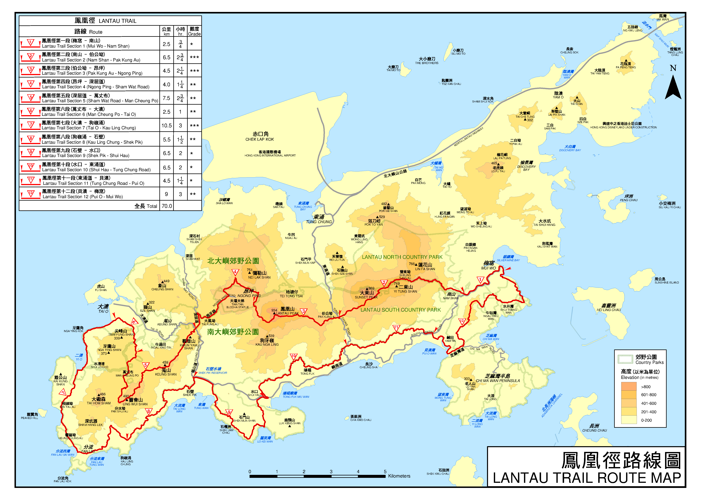

凤凰径（英文：Lantau Trail）是香港著名的远足径，位于香港大屿山，于1984年12月4日启用，由时任渔农自然护理署署长李德宏和新界乡议局副主席曾连主礼。凤凰径是香港第三长的远足径，全长70公里，共分12段，行毕全程大约需时25小时；全程共有140道标距柱，约每500米一道，贯穿南大屿郊野公园及北大屿郊野公园，跨越香港第二高峰凤凰山，绕过石壁水塘主坝，以及经过多个沙滩。

#####第一段

- 路线  
    梅窝 ― 南山
- 长度  
    2.5 km
- 时间  
    0.75 h
- 难度  
    \*
- 简介  
    凤凰径第一段与屿南道行车路并置，从码头一直沿着车路从低处向上行，沿途可眺望梅窝鹿地塘村、大地塘、白银乡、梅窝旧村及涌口，这几条乡村的地形像梅花的五瓣，中部有蝴蝶山构成窝形，「梅窝」便因此得名。凤凰径第一段与屿南道行车路并置，从码头一直沿着车路从低处向上行，便可到达位于大屿山郊野公园内的南山坳顶烧烤场，接续开始第二段的路程。由于山径两旁遍植台湾相思，夏天有遮荫效果，走路时更感轻松。沿途可眺望梅窝鹿地塘村、大地塘、白银乡、梅窝旧村及涌口，这几条乡村的地形像梅花的五瓣，中部有蝴蝶山构成窝形，「梅窝」便因此得名。虽然第一段路程对行山爱好者来说毫无难度，但若要走毕凤凰径全程，建议先在梅窝准备好适量物资，同时在南山坳休憩亭补充体力为上策。

#####第二段

- 路线  
    南山 ― 伯公坳
- 长度  
    6.5 km
- 时间  
    2.75 h
- 难度  
    \***
- 简介  
    山径从阳明山庄起步，旁边的黄泥涌水塘于1899年落成，是香港六个战前水塘之一。之后可慢慢远离南区的恬静悠闲，穿梭港岛东的峰群之中。平日身处湾仔或铜锣湾时没有发现，原来城市被群山包围，登上渣甸山瞭望台就可看到摩天大厦变成微缩模型，安插在一座又一座大山之间，像香港每朝上班的人群，希望挤上维港这班列车。绕过1991年停产的毕拉山石矿场，走至与鲗鱼涌树木研习径重迭的路段会发现几排红砖灶头，是二战时英军为了与敌军人长期作战而建的炉头，但最终未能发挥作用。这列灶头与起步点看到的奥斯本纪念碑一样，记下了1941年香港保卫战的事迹。

#####第三段

- 路线  
    伯公坳 ― 昂坪
- 长度  
    4.5 km
- 时间  
    2.25 h
- 难度  
    \***
- 简介  
    凤凰径以凤凰山为名，凤凰山英文名为「Lantau Peak」，音译便是「烂头山」，源于其山顶状似一凹陷的头部；香港开埠之前，当地村民一直以「烂头」称之，直至19世纪英国人来到后，他们甚至以「烂头」为大屿山命名。第三段从伯公坳上行至凤凰山，「伯公」即「土地」之意，中国人相信是保护当地居民平安的守护神，从海拔300多米的伯公坳上行至934米的凤凰山，沿途多为石阶，而且路况跟第二段相似，只要能找到个人的节奏，要走完这一段路并没有想象中艰辛。凤凰山高耸入云，在山中容易遇到云雾缭绕的状况，如入仙境一样，令人着迷；而在山径旁，更不时见到毛叶杜鹃的踪迹，片片的白色花瓣，煞是好看。想一睹凤凰山蓝天绿林的「高清」面目，建议在初夏的日子前往。从凤凰山山顶沿「天梯」急降而下，即到达昂坪市集，走累了不妨先在市集内休息一下、游览一下。天梯乃由山的大型石块砌成，每行一步都可感受当年砌石成梯的艰辛。

#####第四段

- 路线  
    昂坪 ― 深屈道
- 长度  
    4.0 km
- 时间  
    1.25 h
- 难度  
    \**
- 简介  
    第四段由昂坪出发，起点不远处可看到由38支巨型木柱排成无限符号的「心经简林」，柱上刻有由著名国学家饶宗颐教授亲笔题写的《心经》，具宗教色彩之余亦配合郊野环境。离开昂坪后，接上弥勒山郊游径及昂平路，沿途能侧望凤凰山山脉，绕过石壁水塘北面，可欣赏平静蔚蓝的水塘风光。石壁水塘于1963年竣工，坝面铺上双线公路，兴建前原有石壁围、坟背、岗背、沙咀、涌口及坑仔等六条村落，当年为了开辟水塘，把村民迁徙至荃湾、梅窝及石壁附近的大浪湾，水塘下为昔日的耕地。这段路既走在林间，也走在行车道旁，平缓下行、轻松畅快，可说是上一路段与下一路段之间的缓冲点，值得细心享受。

#####第五段

- 路线  
    深屈道 ― 万丈布
- 长度  
    7.5 km
- 时间  
    2.75 h
- 难度  
    \**
- 简介  
    此段从深屈道与羗山道交汇处凉亭后方的山径起行，依指示前行，可先拜会状似膝盖的膝头哥山(观音山)，再往上行，可俯瞰石壁水塘全景；而在观音山的山林中，还藏着一座历史悠久的观音庙。观音庙建于宣统二年（1910年），外墙漆上朱红色，屋顶则是金黄色，非常抢眼，每年都会吸引不少善信及游人前往参观。从观音山下行，可抵羗山。羗山高459米，西连灵会山，由东北至西南，连绵5个山峰，全长3.5公里，犹如一道屏障一样，把大浪湾和二澳两地东西分隔。从羗山主峰沿凤凰径往西走，地势平坦、泥土肥沃，野草迎风招展。紧接羗山郊游径，可通往万丈布营地，营地既有林泉飞瀑、又有百鸟争鸣，十分写意。

#####第六段

- 路线  
    万丈布 ― 大澳
- 长度  
    2.5 km
- 时间  
    1.0 h
- 难度  
    \**
- 简介  
    大澳水乡有「香港威尼斯」的美誉，位于珠江河口，是香港不少渔民的基地。根据关帝庙内的碑文记载，大澳早年的渔船有三类，分别是罟船、网艇及钓艇，可见渔业发展蓬勃。随着大澳渔业式微，屋下河溪纵横、小船穿梭来往，加上大澳文物酒店开幕，住宿方便，近年更吸引了愈来愈多游客、行山人士及摄影爱好者前往。被山水与棚屋围绕，除了可以海路及陆路前往大澳，由山路出发也别有趣味。凤凰径第六段从龙仔悟园出发，沿指示前行不久会到达「能任亭」，在此能观赏由万丈布延伸至此的石砌古道。随着山路继续下山，可于途中见尽大澳全景，包括天利苑、盐田游乐场、渡轮码头，甚至是新基桥一带棚屋。沿斜坡下行，不久即到南涌村，村内有数间青砖小屋，从南涌村可穿梭大澳的大街小巷，访古寻源，别有一番风味。

#####第七段

- 路线  
    大澳 ― 狗岭涌
- 长度  
    10.5 km
- 时间  
    3.0 h
- 难度  
    \***
- 简介  
    这是凤凰径中最长的一段山径，离开大屿山郊野公园内的高山，由南涌村出发绕过香港最西南面的海岸，正式进入凤凰径平缓的后半段，推介给喜欢看海的人。山径沿途有石滩和红树林，往外看是珠江进入太平洋的出口，河水与海水在此交汇，中华白海豚最喜欢栖居在这种水域。之后是让人愈听愈饿的两个地方，包括香港最西端的营地煎鱼湾，还有离岸不远一个南端凸出、北面凹陷的小岛，因状如鸡翼而被称为「鸡翼角」。再走不远即到观看珠江与太平洋咸淡水交汇的分流，一半碧蓝，一半黄浊，水域分明得像一道无形分界，非常神奇。

#####第八段

- 路线  
    狗岭涌 ― 石壁水塘
- 长度  
    5.5 km
- 时间  
    1.5 h
- 难度  
    \**
- 简介  
    起点为风景优美的狗岭涌营地，狗岭涌东面山丘的观景台可远眺香港最西南面水域的景色，附近亦有一逾百年历史的屿南界碑，为清政府割让新界的最南端位置，与大澳的屿北界碑互相呼应。沿海岸向石壁水塘进发，不时能瞥见外海的索罟群岛，如在雨季途经大浪湾附近山径，更有机会遇上瀑布倾泻而出直奔海湾的画面。沿路会途经大浪湾村，附近有一石壁洪侯古庙，可见当地人同时供奉「南海洪圣大王」洪圣爷，以及南宋末年带着宋帝昺逃难至大屿山和九龙城的侯王杨亮节。第八段路程不长，沿途还有三个营地、野餐设施和多个海湾，想进行各式郊游活动都非常方便。

#####第九段

- 路线  
    石壁水塘 ― 水口
- 长度  
    6.5 km
- 时间  
    2.0 h
- 难度  
    \*
- 简介  
    香港靠水塘供应大部分食水，不少山径都可看到它们的踪影，一半是人造物，一半是自然，正正是本地郊野的特色，第九段路的起点就在石壁水塘的水坝上。石壁水塘于1963年落成，储水量仅次于万宜水库和船湾淡水湖，被东面狗牙岭、北面木鱼山与狮子头山，以及西面的羗山包围，山谷中的石壁大村、坟背村、岗贝村、坑仔村早已淹没其中。水坝东面有一个观景平台，位于主坝路向大澳方向右侧平衡路面上，可在此一览水塘及群峰景色，还有水塘中直径达24米的的泄洪水碗。附近还有一个3,000年前的石刻──大屿山石壁石刻，见证了人类历史和海岸的变迁。在岸边向南张望，是香港最西南端的岛屿群──索罟群岛，由大鸦洲、小鸦洲、孖洲、圆洲等十多个大小海岛组成。虽然小岛位置偏远，但岛上曾发现石器时代的文物。不知道几千年前，这里的居民是否也眺望着同一道风景呢？

#####第十段

- 路线  
    水口 ― 东涌道
- 长度  
    6.5 km
- 时间  
    2.0 h
- 难度  
    \*
- 简介  
    平日困在石屎森林，城市人在假日总是不安于市，这一段路可见多个海湾，是香港人周日出游和渡假的胜地。起点的水口村曾是大屿山一大村落，村内还有多幅农田种植荔枝和木瓜等水果，外面则有一个犹如避风港的天然海湾，缓慢水流形成长长的泥滩，生物多样化，是亲子认识大自然的好地方，潮退时还可能发现马蹄蟹，以及泥滩水面反映成「天空之镜」的景象。中段和后段的塘福和长沙则有非常漂亮的泳滩。原来这里自明代便有人居住，当地曾发掘到不少陶片和石器，不过古人不为渡假，而是被海湾丰富的渔获吸引，沿岸村庄和海边能发现有大大小小的天后宫和关帝庙。

#####第十一段

- 路线  
    东涌道 ― 贝澳
- 长度  
    4.5 km
- 时间  
    1.25 h
- 难度  
    \*
- 简介  
    这里是凤凰径最易走的路段之一，从车路走进林荫山径，会途经多条水涧，林荫后是辽阔的海湾景色，远望是芝麻湾半岛及石鼓洲，近处则是水清沙幼、本地最受欢迎的泳滩之一──贝澳。贝澳地形如螺杯，古称螺杯澳，当地曾发现新石器时代文物，证明古时已有人在当地出没，明朝一本记载广东地方事迹的著作《粤大记》，亦显示贝澳早已有人聚居。贝澳除了渡假屋，泳滩旁亦设有营地、烧烤炉等设施，山径虽短，却足够你流连一整天，乐而忘返。

#####第十二段

- 路线  
    贝澳 ― 梅窝
- 长度  
    9.0 km
- 时间  
    3.0 h
- 难度  
    \*
- 简介  
    凤凰径最后一段，结束第7段至11段的海岸之旅，钻入丛林、登上山岗，从另一角度欣赏大屿山的海湾之美：西边是贝澳湾人潮不断的周末渡假景致，东边则有静逸的芝麻湾，围绕着犹如遗世独立的十塱新村，与水平线尽处的港岛城市景观形成强烈对比。虽然农田早已荒废，放归野外的水牛却为游人记住了往日的田野景色。最后随山路下坡至交通方便的梅窝市中心，附近有名的银矿湾，亦提醒了大家梅窝有一段采矿的历史。1930年代，梅窝慢慢发展为渡假小镇，假日有的游人不绝前来品尝海鲜，热闹非常，让人不期然回味刚刚走过一段写意的山径风光。

######相关链接

- [漁農自然護理署｜郊野樂行](https://www.hiking.gov.hk/)
- [地理資訊地圖（GeoInfo Map）](https://www.map.gov.hk/)
- [綠洲Oasistrek｜香港行山路線](https://www.oasistrek.com/)
- [香港旅遊發展局](https://www.discoverhongkong.com/)