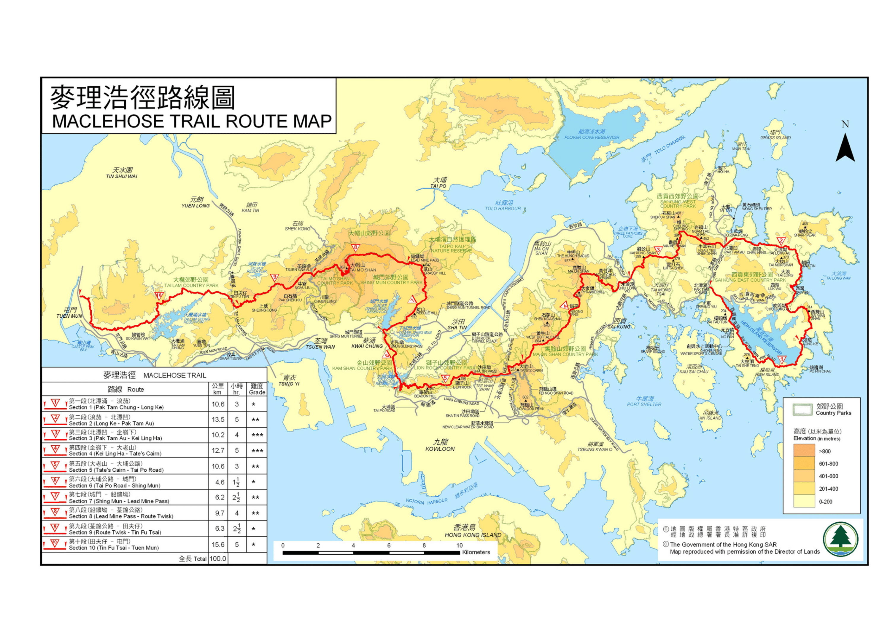

麦理浩径（英语：MacLehose Trail）是香港最早启用的一条长途远足径，于1979年10月26日启用，以时任香港总督麦理浩命名。麦理浩径是香港最长的远足径，全长100公里，共分10段。麦理浩径共有200支标距柱，约每500米一支。整体呈东西走向，起始于西贡北潭涌（大网仔路及北潭路路口，该路口设有本径起点标志），贯穿了西贡东、西贡西、马鞍山、狮子山、金山、城门、大帽山及大榄等多个郊野公园，以屯门为终点。

#####第一段

- 路线  
    北潭涌 ― 浪茄
- 长度  
    10.6 km
- 时间  
    3 h
- 难度  
    \*
- 简介  
    北潭涌至浪茄的路段虽然颇长，但坡度平缓，可谓相当舒适的开段。此段风光一定是湛蓝清澈的万宜水库称霸，水库建成于1979年，当年约有400个客家村落因建水库而需要迁走，可想而知水库工程之浩大。万宜水库东坝的木桥步道、7,000多块的防波锚形石、S形六角岩柱、破边洲等自然及人工景观，从山上到海边，将美景「一网打尽」！走毕全程，可继续前进或到浪茄湾营地逗留，浪茄湾一带的海岸有由流纹岩著称的独特风景，流纹岩是细小粒状的火山岩，在溶岩面层与底层以急速及不同冷却速度的情况下形成，在浪茄湾可尽情欣赏流纹岩所形成的灰啡色六角柱体，或留下来边观看夜空银河、边听着浪涛声，感受不一样的香港之美。

#####第二段

- 路线  
    浪茄 ― 北潭凹
- 长度  
    13.5 km
- 时间  
    5 h
- 难度  
    \**
- 简介  
    麦理浩径第二段是人气爆灯的山径之一，亦最能感受香港海岸之美。第二段开首需要攀上314米高而陡峭的西湾山才能下达有「港版马尔代夫」之称的西湾沙滩。抵达西湾后，蓝天白云、海水清澈，大有「值回票价」之感，西湾观星地点的长椅走线有如音谱，设计有如琴键，日间也可在此休息拍照。从大浪湾继续走，一路经过咸田湾、大浪坳及赤径，赤径村有超过200年历史，现时居民不多，村内的码头、石滩和红树林又是另一番风光，走过一次，令人回味再三。

#####第三段

- 路线  
    北潭凹 ― 企岭下
- 长度  
    10.2 km
- 时间  
    4 h
- 难度  
    \***
- 简介  
    以难度来说，麦理浩径第三段必定入选三甲，峰峦迭起、高低起伏不定，需要攀越岩头山、画眉山、雷打石和鸡公山四个约海拔400米高的高峰，走上山径，不只有「只缘身在此山中」的乐趣，更有「横看成岭侧成峰」的景况。特别在丛林深处，大家还有机会看见隐身其中的旧日梯田踪影。要从起点北潭凹攀上牛耳石山，是麦理浩径第三段的一大挑战。长约一公里的石阶梯，每一级都考验大家的毅力，辛苦走到岩头山上总有回报，东面是企岭下海、北临吐露港，西望大埔，南见马鞍山，抵达山顶嶂上小休后，继续向鸡公山进发，有心挑战这一段路的话，除了足够的休息，还要谨记带备充足粮水作补给！

#####第四段

- 路线  
    企岭下 ― 大老山
- 长度  
    12.7 km
- 时间  
    5 h
- 难度  
    \***
- 简介  
    俗语说「天外有天」，接下来的麦理浩径第四段，更是「山外有山」的写照！从水浪窝穿过黄竹洋村后，沿路攀上高达555米的马鞍山山脊，虽然艰辛，但所谓「欲穷千里目，更上一层楼」，居高临下但见盐田仔及滘西洲等地；抵达昂平，开阔的高原就在眼前展开，行至水牛山山腰，到了春天，更有机会遇见徐徐转红的漫山楠树，风光独好！从水牛山西行至基维尔营地，第四段才告一段落。基维尔营地是香港童军的重要基地，虽然不对外开放，但营地前便是著名的麦径长城，大部分地面以大石砌成，置身其间，恍如走在万里长城上。能够走完第四段，也是令人自豪的。

#####第五段

- 路线  
    大老山 ― 大埔公路
- 长度  
    10.6 km
- 时间  
    3 h
- 难度  
    \**
- 简介  
    麦理浩径跨越多个山头，第五段是与市区最接近的一段，亦是较易走的一段，路上还有机会看到不少二战遗迹如战壕与地洞，部分战壕更深达一米，对不少本地行山客来说，自是壮观。由基维尔营地至大老山，越过山脊之后即可沿沙田坳道下达至沙田坳的狮子亭，经过鸡胸山，便是香港回归纪念亭，在凉亭处风光无限，远眺东九龙及启德邮轮码头，视野甚至远及维多利亚港及港岛东，在此拍照，风光一绝。值得一提的，还有笔架山上的雷达站，南朝九龙、北望沙田，景致一望无际。

#####第六段

- 路线  
    大埔公路 ― 城门
- 长度  
    4.6 km
- 时间  
    1.5 h
- 难度  
    \*
- 简介  
    第六段是麦理浩径路程最短、最易走的一段，因此颇受行山初哥欢迎。从大埔公路出发，经九龙水塘至城门水塘。而九龙水塘于1920年代建成，整个水塘群乃由九龙水塘、九龙副水塘、九龙接收水塘及石梨贝水塘组成，九龙水塘的主坝、水掣房、溢洪坝及溢洪坝记录仪器房及另一个记录仪器房均为香港法定古迹，宏伟的水坝加上活泼的猕猴，比其他路段更为热闹、更富生气。我们所看见的猕猴，是从外地带来香港所衍生的后裔，当初引进来是希望猕猴吃掉有毒的「马钱子」 ― 香港四大毒草之一，以保障水塘食水安全。走上城门附近的孖指径，可一睹城门碉堡及舒佛毕利巷、丽晶街等隧道遗迹，认识香港保卫战历史，还可以趁机俯瞰荃湾与葵涌的人间烟火，益发教人珍惜香港山径与城市毗邻的便利与价值。

#####第七段

- 路线  
    城门 ― 铅矿坳
- 长度  
    6.2 km
- 时间  
    2.5 h
- 难度  
    \**
- 简介  
    城门水塘建成于1937年，其主坝、铁桥、水掣房和钟形溢流口已列为一级历史建筑，也是最受香港人欢迎的郊游地点之一，郊野公园范围内更记录过百种蝴蝶，绕湖的一排白千层更是游人「打卡」胜地。水塘连接往针山的路段，有传针山来自客家话中的「尖山」，虽只有海拔532米，但山如其名，极之陡峭。广东话俗语「针唔拮到肉唔知痛」，亲身体验才能领略个中滋味，登上针山山顶，须在1.7公里内爬过千级楼梯，加上树木稀少，考验登山者的耐力和意志力。不过针山风光是绝对值得游人付出，登顶后面前是沙田全景，背后则能越过狭长的水塘饱览葵涌、青衣及荃湾景色。后段登上高647米的草山，视野更为辽阔，此为行山人士称为「针、草、帽（针山、草山、大帽三山对望）」之旅。沿路走至铅矿坳的终点均有美景相伴，绝不闷场。

#####第八段

- 路线  
    铅矿坳 ― 荃锦公路
- 长度  
    9.7 km
- 时间  
    4 h
- 难度  
    \**
- 简介  
    香港昔日拥有多个矿场，铅矿坳是其中之一。 1930年代已有人在城门郊野公园东部开采矿石，直至1960年代由于海外多个新兴大型矿场落成，加上矿石价格急跌，使矿场被荒废丢空，至今铅矿坳还留有多个近百年历史的矿洞。别被铅矿坳起步接连爬升的600级阶梯吓怕，第八段余下的登山路径都平坦易走。途中经过的大帽山高975米，是香港第一高峰，亦是城门河及林村河的起源。北面山坡的湿冷环境乃茶花的生长地，而往日的梯形茶田遗址仍依稀可见。深秋的大帽山则有大片黄金芒草吸引无数游人拍照，山头亦不时见牛只相偎休息。高山风景，从来都是登山的最好回报：晴空万里时，身在大帽山可饱览新界的景色，由青马大桥以至深圳都可一览无遗；湿气集结时，与山下隔着一片迷雾，又是另一番诗情画意。

#####第九段

- 路线  
    荃锦公路 ― 田夫仔
- 长度  
    6.3 km
- 时间  
    2.5 h
- 难度  
    \*
- 简介  
    山径起步不久便有一开扬的观景地点，南面能尽览荃湾及昂船洲大桥景色，北面则有被树林包围的河背水塘。河背水塘为新界西北的农民提供灌溉用水源，平静的水面中间躺着小岛，山下是八乡、石岗和锦田的乡村平原风光。细心看，路边还可以找到一个荒废了的矿洞。走在林荫大道中，夏天也不觉闷热。如果在春天出游，又会是另一番光景，沿途能发现本地野生的红杜鹃吐艳，把山坡染上一抹红。也别忘了脚边一小束小巧玲珑的韩信草，紫蓝色的花，据说韩信是汉朝大将军，常以此草药为伤兵治病，及后便称此草药为韩信草。路上可见花托膨胀成球状，有如草莓般的蛇莓、还有花看上去似是一颗颗眼球的鱼眼草。

#####第十段

- 路线  
    田夫仔 ― 屯门
- 长度  
    15.6 km
- 时间  
    5 h
- 难度  
    \*
- 简介  
    麦理浩径最后一段也是最长的一段，横跨近半个大榄郊野公园至屯门市。前段途经的吉庆桥位处山涧交汇点，曾是连接元朗至荃湾的重要通道，昔日建有七座小渡桥，居民都称这里为「七渡河」。直至1868年，当地人集资建造了吉庆桥，古庆桥又在1950年代兴建大榄涌水塘时重修至现在的模样。走至标距柱M173附近，你会发现其中一段小渡桥的踪影，这里还是烟翅绿色蟌出没的地方呢！沿大榄涌水塘北面而行，水塘于1957年落成，是香港在二战后首个兴建的水塘，45米高的主坝横跨大榄涌谷，是新界里由河谷筑堤建成的最大水塘。由于水塘所处的河谷是丘陵地带，储水后便形成了多个岛屿，形成了今天绿油油的「香港千岛湖」之景。

######乐施毅行者

「乐施毅行者」是香港最大型的远足筹款活动。每年11月的第3个周末，乐施会均于麦理浩径举办毅行者。参加者必须四人组成一队，日夜赶路，於48小时内横越100公里麦理浩径，一路上互相扶持，互相鼓励，共同克服种种困难。

######相关链接

- [漁農自然護理署｜郊野樂行](https://www.hiking.gov.hk/)
- [地理資訊地圖（GeoInfo Map）](https://www.map.gov.hk/)
- [綠洲Oasistrek｜香港行山路線](https://www.oasistrek.com/)
- [香港旅遊發展局](https://www.discoverhongkong.com/)
- [樂施毅行者｜樂施會](https://www.oxfamtrailwalker.org.hk/)