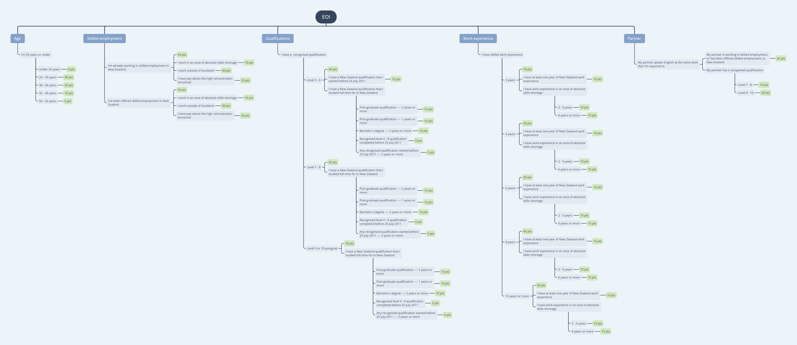

###Skilled Migrant Category

New Zealand offers many opportunities for skilled migrants, particularly in industries and regions experiencing growth and skill shortages. The Skilled Migrant Category is for potential migrants who are interested in gaining New Zealand residence and have readily transferable skills and experience.

###Expression of Interest (EOI)

Applying under the Skilled Migrant Category is a two-stage process: you submit an EOI into the EOI Pool and wait to see if it is selected. If you are invited to apply for residence, you then have a four month period to lodge a residence application.

###Prerequisites

To be considered under this category you need to be of good health, good character, meet English language requirements and be under 56 years of age. To have an EOI accepted, you will also need to be claiming at least 160 points for what are called ‘employability and capacity building factors’—factors such as skilled employment, recognised qualifications and skilled work experience.

###The points system

The points system is designed to prioritise potential migrants who have the most to offer New Zealand so that Immigration New Zealand (INZ) can decide who to invite to apply for residence. Points are available for skilled employment in New Zealand, skilled work experience, qualifications and age. A variety of bonus points are also available for factors such as employment in areas of skill shortage and partner’s qualifications.

#####Points Indicator for Skilled Migrant Expression of Interest

#####Age

- __I'm 55 years or under__

    + Under 20 years (0 pts)
    + 20 - 39 years (30 pts)
    + 40 - 44 years (20 pts)
    + 45 - 49 years (10 pts)
    + 50 - 55 years (5 pts)

#####Skilled employment

- __I'm already working in skilled employment in New Zealand (50 pts)__

    1. I work in an area of absolute skills shortage (10 pts)
    2. I work outside of Auckland (30 pts)
    3. I have pay above the high remuneration threshold (20 pts)
- __I've been offered skilled employment in New Zealand (50 pts)__

    1. I work in an area of absolute skills shortage (10 pts)
    2. I work outside of Auckland (30 pts)
    3. I have pay above the high remuneration threshold (20 pts)

#####Qualifications

- __I have a  recognised qualification__
    + Level 3 - 6 (40 pts)
        1. I have a New Zealand qualification that I started before 25 July 2011 (10 pts)
        2. I have a New Zealand qualification that I studied full-time for in New Zealand
            + Post-graduate qualification ---- 2 years or more (15 pts)
            + Post-graduate qualification ---- 1 years or more (10 pts)
            + Bachelor's degree ---- 2 years or more (10 pts)
            + Recognised level 4 - 8 qualification completed before 25 July 2011 (5 pts)
            + Any recognised qualification started before 25 July 2011 ---- 2 years or more (5 pts)
    + Level 7 - 8 (50 pts)
        1. I have a New Zealand qualification that I studied full-time for in New Zealand
            + Post-graduate qualification ---- 2 years or more (15 pts)
            + Post-graduate qualification ---- 1 years or more (10 pts)
            + Bachelor's degree ---- 2 years or more (10 pts)
            + Recognised level 4 - 8 qualification completed before 25 July 2011 (5 pts)
            + Any recognised qualification started before 25 July 2011 ---- 2 years or more (5 pts)
    + Level 9 or 10 postgrad (70 pts)
        1. I have a New Zealand qualification that I studied full-time for in New Zealand
            + Post-graduate qualification ---- 2 years or more (15 pts)
            + Post-graduate qualification ---- 1 years or more (10 pts)
            + Bachelor's degree ---- 2 years or more (10 pts)
            + Recognised level 4 - 8 qualification completed before 25 July 2011 (5 pts)
            + Any recognised qualification started before 25 July 2011 ---- 2 years or more (5 pts)

#####Work experience

- __I have skilled work experience__
    + 2 years (10 pts)
        1. I have at least one year of New Zealand work experience (10 pts)
        2. I have work experience in an area of absolute skills shortage
            + 2 - 5 years (10 pts)
            + 6 years or more (15 pts)
    + 4 years (20 pts)
        1. I have at least one year of New Zealand work experience (10 pts)
        2. I have work experience in an area of absolute skills shortage
            + 2 - 5 years (10 pts)
            + 6 years or more (15 pts)
    + 6 years (30 pts)
        1. I have at least one year of New Zealand work experience (10 pts)
        2. I have work experience in an area of absolute skills shortage
            + 2 - 5 years (10 pts)
            + 6 years or more (15 pts)
    + 8 years (40 pts)
        1. I have at least one year of New Zealand work experience (10 pts)
        2. I have work experience in an area of absolute skills shortage
            + 2 - 5 years (10 pts)
            + 6 years or more (15 pts)
    + 10 years or more (50 pts)
        1. I have at least one year of New Zealand work experience (10 pts)
        2. I have work experience in an area of absolute skills shortage
            + 2 - 5 years (10 pts)
            + 6 years or more (15 pts)

#####Partner

- __My partner speaks English at the same level that I'm required to__
    1. My partner is working in skilled employment, or has been offered skilled employment, in New Zealand (20 pts)
    2. My partner has a recognised qualification
        + Level 7 - 8 (10 pts)
        + Level 9 - 10 (20 pts)

