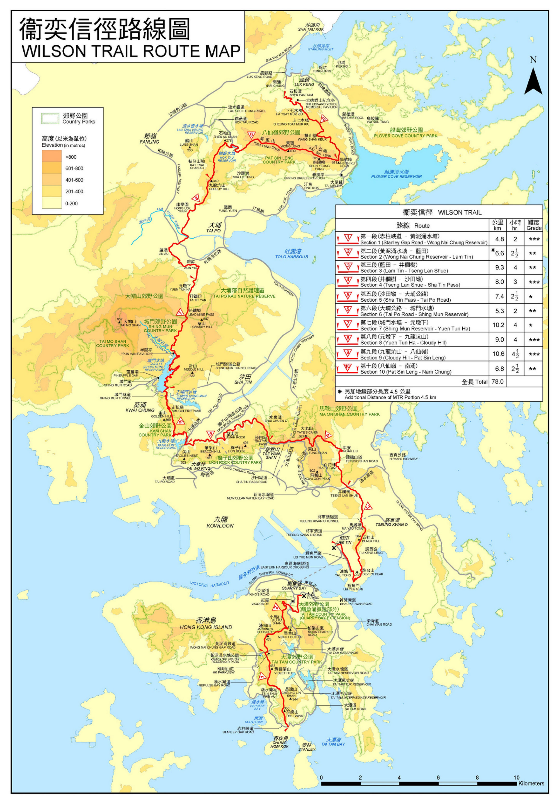

卫奕信径（英语：Wilson Trail）是香港一条长途远足径，于1996年启用，全长78公里，共分10段，为香港第二长的远足径，仅次于麦理浩径之后。本径由香港岛南边的赤柱蜿蜒至新界东北的南涌，越过香港众多崇山峻岭，贯穿香港8座郊野公园：大潭郊野公园、大潭郊野公园（鲗鱼涌扩建部分）、马鞍山郊野公园、狮子山郊野公园、金山郊野公园、城门郊野公园、大帽山郊野公园以及八仙岭郊野公园。卫奕信径的名称是为了纪念钟情于香港山水及远足活动的第27任香港总督卫奕信而建。

因为定线的问题，卫奕信径无可避免地需要穿过市区，包括港岛东部、九龙东部和大埔。而且因为第二段和第三段被维多利亚港所阻，所以卫奕信径成为香港唯一一条不连贯的长途远足径。此径起于赤柱赤柱峡道，向北经过港岛的数个山峰到达鲗鱼涌。之后需在太古站乘港铁到蓝田站。于蓝田继续，经启田道和鲤鱼门道到油塘（此段虽长约1.6公里，但因位于市区，所以不设标距柱），越过魔鬼山、五桂山等，转向西面，到达九龙群山，再从九龙水塘开始往北走到达九龙坑山，向东登上八仙岭，最后再转西北方下降至南涌作为终点。

#####第一段

- 路线  
    赤柱峡道 ― 黄泥涌水塘
- 长度  
    4.8 km
- 时间  
    2 h
- 难度  
    \***
- 简介  
    卫奕信径中有数之不尽的爬坡，绝不能少看它的难度。第一段起步不久，立即要跨越孖岗山过千级的石阶，分别登上海拔386米及363米的南岗山与北岗山。不过，再累也别忘了好好接收爬坡的回礼―在观景台回望圣士提反湾、赤柱正滩、鹤嘴半岛、螺洲和最尽头的蒲台岛景色，春季会遇上盛放的粉红野牡丹，秋冬时份则有满山绽放的大头茶，白花如繁星点缀山坡。山径是公平的，有上便有落，孖岗山之后是一段急下坡，风景换成林荫渐浓的山谷和大潭笃水塘，然后登上紫罗兰山。每逢农曆新年，山顶都可鸟瞰在北坡吐豔、本地原生的吊钟花群，如指头大的粉红色吊钟花挂满树上。下降至黄泥涌水塘公园的最后一程山径，更可近距离拍下吊钟花精緻的一面，作为卫奕信径第一段的甜点。

#####第二段

- 路线  
    黄泥涌水塘 ― 蓝田
- 长度  
    6.6 km
- 时间  
    2.5 h
- 难度  
    \**
- 简介  
    山径从阳明山庄起步，旁边的黄泥涌水塘于1899年落成，是香港六个战前水塘之一。之后可慢慢远离南区的恬静悠闲，穿梭港岛东的峰群之中。平日身处湾仔或铜锣湾时没有发现，原来城市被群山包围，登上渣甸山瞭望台就可看到摩天大厦变成微缩模型，安插在一座又一座大山之间，像香港每朝上班的人群，希望挤上维港这班列车。绕过1991年停产的毕拉山石矿场，走至与鲗鱼涌树木研习径重迭的路段会发现几排红砖灶头，是二战时英军为了与敌军人长期作战而建的炉头，但最终未能发挥作用。这列灶头与起步点看到的奥斯本纪念碑一样，记下了1941年香港保卫战的事迹。

#####第三段

- 路线  
    蓝田 ― 井栏树
- 长度  
    9.3 km
- 时间  
    4 h
- 难度  
    \**
- 简介  
    卫奕信径横跨港九新界，第三段与第二段隔了一个维多利亚港，作为九龙部分的起点，这一段经过多个战时遗迹，包括魔鬼山（又称炮台山）碉堡遗址。魔鬼山从前叫「鸡婆山」，在清代一度被海盗占为据点，沦落为罪恶温床，成了附近村民口中的「恶魔山」，后来根据英文「Devil’s Peak」翻译为今天的魔鬼山。现在所见的碉堡为驻港英军所建，以镇守维多利亚港的东面入口。虽然炮台早已撤走，但完整的环型碉堡依然吸引。相隔不远的山顶炮台位置景观更开扬，是观赏日出日落的好地方。后段登上五桂山是全程的最高点，可俯瞰将军澳新市镇，相比之下，终点的井栏树旧式乡村则别有一番风味。

#####第四段

- 路线  
    井栏树 ― 沙田坳
- 长度  
    8.0 km
- 时间  
    3 h
- 难度  
    \***
- 简介  
    要看香港万家灯火的美景，港岛太平山一带固然是理想位置，原来走入卫奕信径第四段，也可以从东山凉亭上欣赏到华灯初上的日落美景，一轮「咸蛋黄」照亮了整个九龙东，煞是吸引。此段由井栏树出发、以沙田坳为终点，开段是清凉茂林、平坦古道。古道连接九龙与西贡蚝涌，是从前西贡村民进出九龙的要道。走过古道继续下山便到达大蓝湖村，幸运的话会遇上香港体型最大的蝴蝶―—裳凤蝶。走过了引水道，便是登山旅程的开始，也是第四段最艰辛之处。徐徐上山，途上见飞鹅山、象山在眼前连绵伸展，背后则是山明水秀的白沙湾，景色豁然开朗，与开段对比鲜明，这一段路可谓变化万千。经过飞鹅山道至东山，不久便到晓晨亭，可俯瞰九龙东及香港启德机场旧址一带，以及塞拉利昂与毕架山的壮丽景色。再沿沙田拗道一直走至沙田拗，便可经观音佛堂下山至慈云山离开。经过佛堂时可顺道拜访姻缘石，为旅程画上完美句号。

#####第五段

- 路线  
    沙田坳 ― 大埔公路
- 长度  
    7.4 km
- 时间  
    2.5 h
- 难度  
    \*
- 简介  
    此段轻松易走，加上沿途可以欣赏到大部分沙田、大围、吐露港及远至是马鞍山的景色，对于远足初哥或带小朋友远足的朋友而言，这段路是不错的选择。第五段以深山小径开启旅程，约一公里的上坡路之后，便是下达山腰的下坡之行。只要一直沿着山腰的引水道前行，往上仰望，望夫石就在左边山顶。望夫石由一大一小两块石头组成，因形状貌似妇人背着小孩眺望远方，恍如仰望夫君回家，故有「望夫石」之称。在山腰紧接九龙山健身径，一直前行便可直达终点大埔公路。第五段不少路段都在山腰行走，沿途有不少植物可供观赏，包括栀子、耳果相思、金银花、木荷、粉叶羊蹄甲及白花灯笼等等，色彩缤纷，都是城市中难以见到的大自然风光。

#####第六段

- 路线  
    大埔公路 ― 城门水塘
- 长度  
    5.3 km
- 时间  
    2 h
- 难度  
    \**
- 简介  
    这段路先后途经三个水塘，包括九龙水塘、石梨贝水塘及城门水塘，湛蓝水色与周边翠绿葱郁的茂林互相映照，令人恋恋不去。九龙水塘的多个构建物，如主坝、主坝水掣房及记录仪器房等已被列为法定古迹，远足时可同时认识香港水塘历史。从大埔公路行至城门水塘，沿途最大的特色是与「驻守」各处的猕猴和平共处。关于这段路上「马骝山」的由来，原来也跟水塘不无关系。话说当年兴建九龙水塘时，发现附近长了不少马钱，马钱毒性强烈、足以致命，但对猕猴来说却并无害处；由于忧虑马钱果实一旦跌进水塘会污染食水，于是当局特别引入爱吃马钱果实的猕猴来应对，自此它们便在此落地生根，而城门水塘亦成了人所共知的「马骝山」。既然猕猴于保护水塘有功，大家在行山时亦要爱护它们，不喂食、不恐吓，自然能和平共处。

#####第七段

- 路线  
    城门水塘 ― 元墩下
- 长度  
    10.2 km
- 时间  
    4 h
- 难度  
    \*
- 简介  
    香港的水塘既融合湖光山色，又不受海岸浪潮威胁，一直以来都是大众周末出游的理想地点。第七段是绕着城门水塘而行，雨季时，水塘的钟形溢流口可将多余的储水排到下城门水塘，甚是壮观。无风的日子可欣赏如镜般平静的城门水塘，加上对岸白千层密林盘缠交错的树根，以及其在水塘中的倒影，均带来无限惊喜。途经半闲亭，夏天有机会一睹「水浸白千层」的自然胜景，冬天则是绿草如茵。抵达元墩下前经过的铅矿坳，是昔日盛产钨矿及铅矿之地，现为麦理浩径及卫奕信径的交汇处，常有游人及牛群在此驻足休息，大家走累了，也不妨在此歇歇吧。

#####第八段

- 路线  
    元墩下 ― 九龙坑山
- 长度  
    9.0 km
- 时间  
    4 h
- 难度  
    \***
- 简介  
    第八段并非郊野公园范围，起点是新屋家上碗窑。碗窑至大埔头敬罗家塾一段，可谓文化探索之旅。相传自明朝开始，由于大帽山流水充足，加上泥土蕴藏着丰富的瓷土矿，这里的山岗曾一度变成烧窑场，在樊仙宫后甚至保留着古窑遗址。随着山径海拔上升，视野更为开扬，回头即见远处的船湾淡水湖。随后路径渐转下降，走过配水库后路径渐渐宽阔，九龙坑山尽入眼底。要走毕九龙坑山，是这段路最大的挑战，连绵向上的阶梯宛如天梯一样。沿途至山顶共设有5个凉亭，大家可以此为目标，每到达一个凉亭便稍作休息。到达第一个凉亭，可以俯瞰康乐园，细看城市跟山野融合的香港特色。继续走会看见玉秀峰的路边石，向前望便是天文台发射站，也即是九龙坑山山顶，标志着第八段的终点。

#####第九段

- 路线  
    九龙坑山 ― 八仙岭
- 长度  
    10.6 km
- 时间  
    4.5 h
- 难度  
    \***
- 简介  
    第九段由九龙坑山山顶出发，经鹤薮水塘、屏风山至八仙岭，最后以仙姑峰为终点。鹤薮水塘静美如画，幽谷翠坡环抱，令人徘徊不去。在分岔口缓上小径便正式开展八仙岭山峰纵走之旅，可说是整条卫奕信径最难走的路段之一。屏风山南面峭壁恍如一道将新界东北及大埔的屏风，走在山脊之上，视野开阔，能360度极目新界东北一带。八仙岭以道教八仙为名，由西至东，各山峰依次名为纯阳、钟离、果老、拐李、曹舅、采和、湘子及仙姑峰。各山峰均设有特色指示牌，既可打卡又可打气。

#####第十段

- 路线  
    八仙岭 ― 南涌
- 长度  
    6.8 km
- 时间  
    2 h
- 难度  
    \**
- 简介  
    最后一段沿途风景醉人，走来实在轻松。从第九段终点仙姑峰起步，沿山峰踏着石级向下走，便可接上八仙岭自然教育径。边走边看见破屋断墙，便知已抵荒废的横山脚下村。村中的石磴古道保存完好，一直延展至七木桥，故又有「横七古道」之称，是昔日村民来往新娘潭与大美督的要道。经过横山脚上、下村，总会在尤德爵士纪念亭休息打卡。尤德爵士纪念亭乃为纪念香港第26任港督尤德爵士而设，置身其中，可观赏到沙头角海及南涌一带的自然风光。南涌鱼塘处处，泥滩和红树林生机处处，行毕第十段依然令人乐而忘返。

######相关链接

- [漁農自然護理署｜郊野樂行](https://www.hiking.gov.hk/)
- [地理資訊地圖（GeoInfo Map）](https://www.map.gov.hk/)
- [綠洲Oasistrek｜香港行山路線](https://www.oasistrek.com/)
- [香港旅遊發展局](https://www.discoverhongkong.com/)