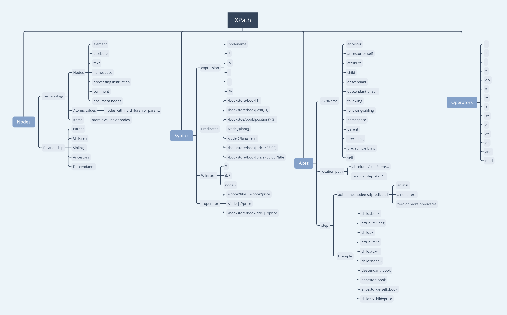

####Nodes

- __Terminology__
    + Nodes
        * element
        * attribute
        * text
        * namespace
        * processing-instruction
        * comment
        * document nodes
    + Atomic values  
        nodes with no children or parent.
    + Items  
        atomic values or nodes.
- __Relationship__
    + Parent
    + Children
    + Siblings
    + Ancestors
    + Descendants

####Syntax

- __expression__
    + nodename
    + /
    + //
    + .
    + ..
    + @
- __Predicates__
    + /bookstore/book[1]
    + /bookstore/book[last()-1]
    + /bookstoe/book[position()<3]
    + //title[@lang]
    + //title[@lang='en']
    + /bookstore/book[price>35.00]
    + /bookstore/book[price>35.00]/title
- __Wildcard__
    + *
    + @*
    + node()
- __| operator__
    + //book/title | //book/price
    + //title | //price
    + /bookstore/book/title | //price

####Axes

- __AxisName__
    + ancestor
    + ancestor-or-self
    + attribute
    + child
    + descendant
    + descendant-of-self
    + following
    + following-sibling
    + namespace
    + parent
    + preceding
    + preceding-sibling
    + self
- __location path__
    + absolute: /step/step/...
    + relative: step/step/...
- __step__
    + axisname::nodetest[predicate]
        * an axis
        * a node-text
        * zero or more predicates
    + Example
        * child::book
        * attribute::lang
        * child::*
        * attribute::*
        * child::text()
        * child::node()
        * descendant::book
        * ancestor::book
        * ancestor-or-self::book
        * child::*/child::price

####Operators

- |
- +
- -
- *
- div
- =
- !=
- <
- <=
- \>
- \>=
- or
- and
- mod

