原创：深瑞内马尔

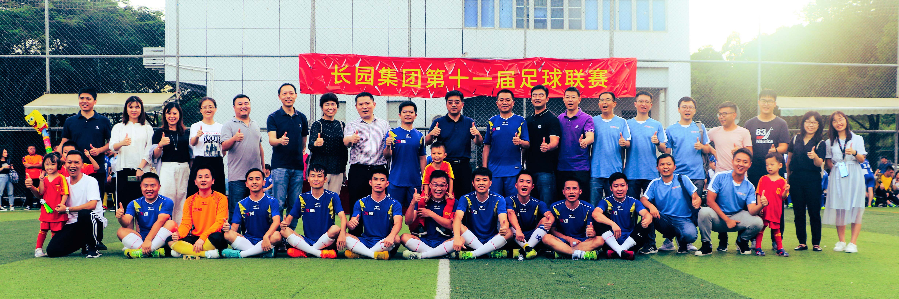

###
初来乍到

当时光的列车缓缓驶过长园总部球场，23岁的深瑞内马尔就躺在那里，深情的目光望过去，都是自己20岁的影子。三年前，仍是学生身份的我满载着兴奋和激情来到公司实习，彼时的我仍热衷于篮球世界，足球对我来说只能算是初涉。还记得2016年3月11日周五的那个夜晚，只身一人翘过了当晚的课程来到球场，第一次亲眼目睹了深瑞足协众多球星的风采。初来乍到的自己，满脸都写着稚气、羞涩和腼腆，场上的邓主席招手一挥，就像一位卖弄风骚的老妇人招揽客人一般，示意让我上场，从此搭上了深瑞足协这辆更安全更智慧的列车……

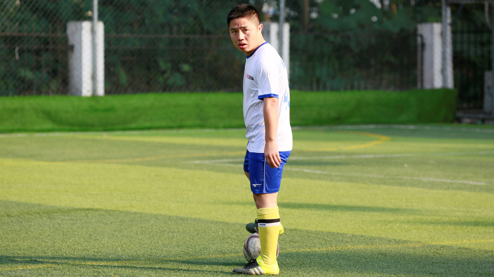

都说陌生环境里第一个认识的人总是会让人倍感亲切，毕生难忘。依稀记得那是一场公司足协受供应商邀请的友谊赛，自己作为一名新人初入深瑞足协这个大家庭总会感到些许拘谨，彼时有非洲梅西著称的冯斌无论是在场上还是场下都对我尽显照顾，场上传球喂饼，场下寒暄两语，就是这么几个体贴的动作使得斌哥的面孔在我的脑海里刻下了深深的烙印，挥之不去；时至今日，每每见到斌哥时，搞基之情总会油然而生，仿佛就像内马尔刚到巴萨时期备受梅西照顾那般，令人生羡。

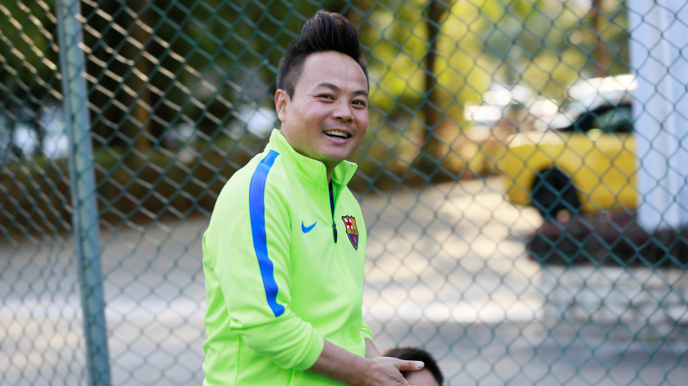

###
渐入佳境

最初的我，连最基本的动作都显得手无足措，停不住球、传不出球，队友怨声载道，唇焦口燥呼不得；彼时的我俨然就像一个进攻终结者，在队友眼里那是真的独，只有自己知道那不是独，那是真的菜。停球全靠蒙、过人全靠趟、射门全靠天。现如今，虽说自己仍未能像生哥那样稳稳地将皮球停在脚下，传出像俞总那般奶妈式传球，射出像张秘那种势大力沉的射门，但是至少可以骄傲地说出我的翻滚像内马尔。如果说，初入球场的我就像一匹脱缰的野马，只会肆无忌惮的奔跑，那么，经过深瑞足协的洗礼之后，自己已然成为了一名练习时长两年半的演员练习生，喜欢滚、跳、躺、足球，music……

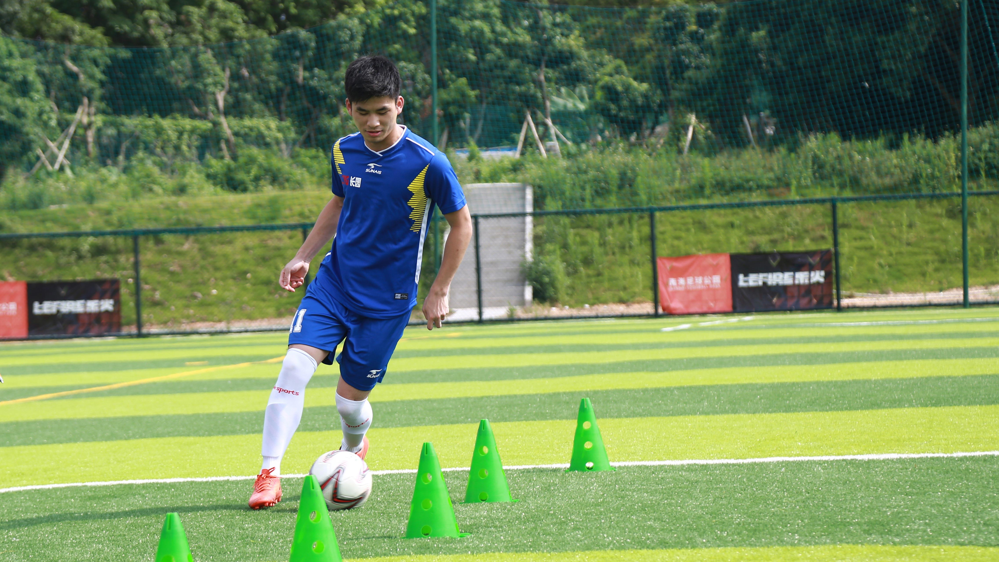

三年的漫长岁月足以改变一些人和一些事，但有些东西是改变不了的，比如深瑞足协每周五的日常训练活动，每年都会举行的“兄弟杯“驻内驻外足球友谊对抗赛，以及像”迎新杯“、”贺岁杯“和观看欧冠决赛等极具凝聚力的足协活动。足球是让大家忘掉一切疲惫和烦恼的最好的精神家园，正如公司所倡导的“健康生活，快乐工作”理念，大家在经过一周的辛勤劳作之后能够来到球场上相互切磋和放飞自我，就足以让人心生愉悦。偶尔还能齐聚醉翁亭，酒肉穿肠过，三巡之后倾谈各自的风骚事迹和家常小事。种种活动无不体现出深瑞足协作为一个平台给大家带来的无尽欢乐，更是作为一个大家庭把各位兄弟姐妹凝聚起来加深彼此之间的感情。无论是一句“卧槽”，还是一句“阿西吧”，总有一个人，会在你的心中，留下深深的烙印。

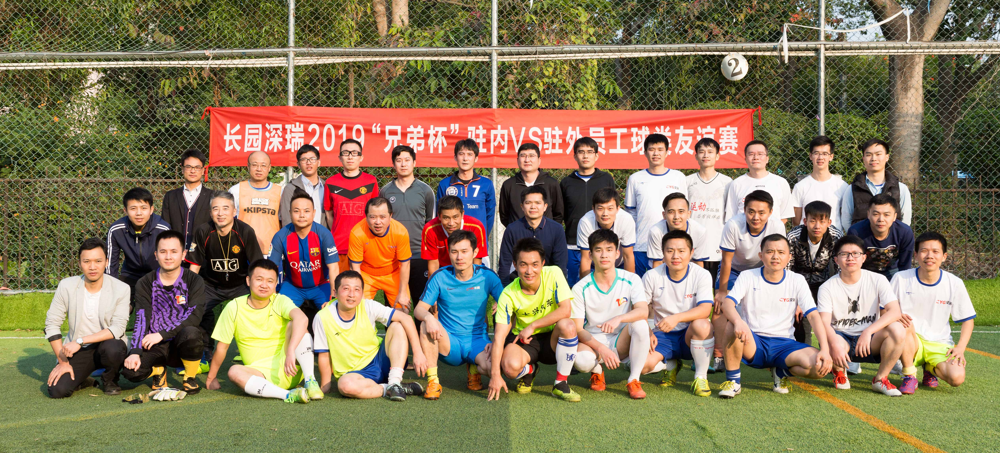

###
深瑞王朝

他们曾以黑马身份出道强势入主，却在巅峰之际快速陨落；他们曾连续四次与奖杯擦肩而过，却又以王者姿态回归连夺三冠。他们曾被称作千年老二，也被誉为冠军之师。他们是深瑞军团，雍容华贵又惊艳到无懈可击，有多少人爱这支球队，就有多少人恨这支球队。在长园集团足球联赛的众多参赛队伍里，长园深瑞无疑是独一档的存在，八个赛季，七进决赛，四次登顶，王者称霸，舍我其谁！

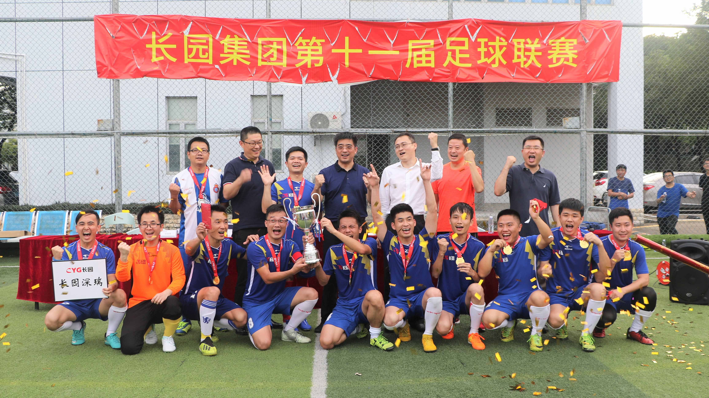

#####初露锋芒

深瑞军团自2008年第一次参加“长园集团第四届足球联赛”开始，就以黑马身份挺进当年的决赛并力克老牌强旅长园电子夺得第一座联赛冠军奖座；正所谓初生牛犊不怕虎，揭幕战上，深瑞军团便以7-1的大比分击败长园总部这支老牌队伍，开启了联赛的征战之路。小组赛中又连克长园嘉彩和东莞三联，顺利挺进淘汰赛。半决赛便遇上了当时的冠军队伍长园电力，凭借球员的出色表现和坚持不懈，球队在比赛中艰难逆转对手成功晋级，与长园电子会师决赛。作为老牌劲旅球队，长园电子之前曾多次在决赛中败给长园电力，上一届更是在决赛中凭借点球大战输给了长园电力与冠军擦肩而过；而这一次，面对一支新军的挑战，他们也必定对冠军奖座虎视眈眈，势在必得。然而，命运的天秤终究还是倾向到深瑞军团这一边，决赛中比赛场面异常激烈，场上气氛令人惊心动魄，深瑞军团最终有惊无险地拿下比赛，成功登顶，一炮而红。彼时，深瑞军团阵中坐拥蔡建雄、罗来峰、李坚良和俞伟国等多名球星，日后他们也被称作08黄金一代。

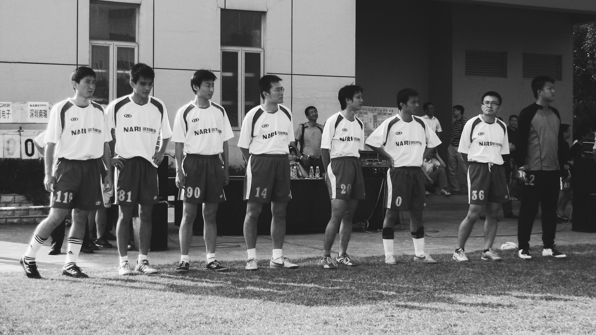

#####沉寂多年

时隔一年，深瑞军团携带着昔日的荣光在小组赛中横扫对手，半决赛又一次力克长园电子，可惜决赛中不敌长园电力，无缘卫冕。2010年赛季，深瑞足协迎来了一位新的掌门人，邓主席临危受命，接手足协带队出征。小组赛中曾以17-0的大比分血洗东莞三联，创造了当时长园集团足球联赛有史以来最大比分记录。然而好景不长，半决赛中面对长园电子被成功复仇，邓主席上任第一年就这样早早地黯淡收场。2011年赛季，邓主席重整旗鼓带领球队再次杀入决赛，面对长园电子未能成功复仇，此后联赛赛制改为两年一届。两年休赛期间，深瑞军团迎来了张泽江、陈仓胜和林日宏等超级新援的加入，郑玉成则由球员身份转型为球队教练，接过教鞭与邓主席携手打造一支全新的深瑞军团。时间来到了2013年赛季，深瑞军团在小组赛和半决赛中接连击退长园电力和长园总部等老牌劲敌，初步显露了这支球队的实战效果；然而，或许是球员之间的磨合不够，又或许是命运的魔咒已定，决赛赛场上再一次被长园电子斩落马下。邓主席带领的这支球队连续三个赛季折戟在同一个对手手中，长园电子俨然成为了深瑞军团的宿敌。邓主席也许相信宿敌的存在，但是绝不会向这种宿命低头。

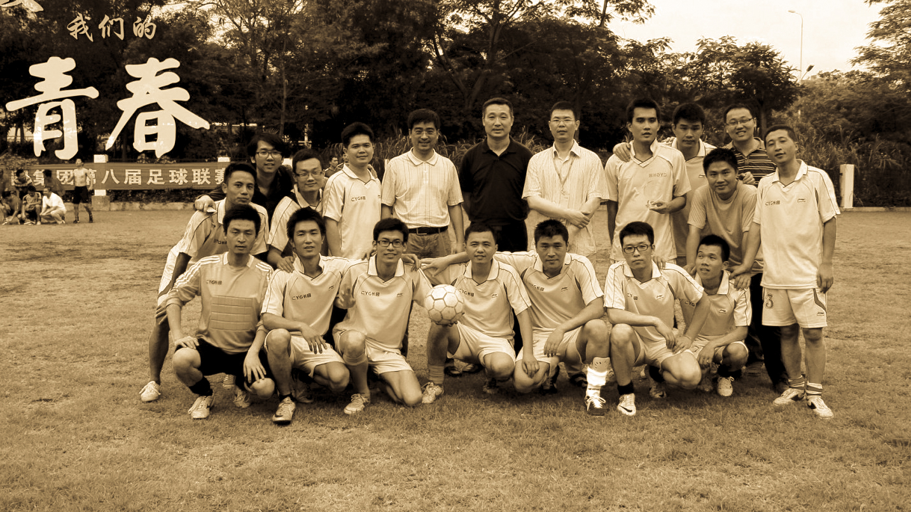

#####王者归来

时过境迁，岁月流连，深瑞军团距离上一次夺冠已有七年之久。自2010年接任球队以来，连续带队出征三个赛季未尝一冠，深瑞足协当家人邓主席纵使心灰意冷，却仍心有不甘，决定扛起大旗继续前进。正所谓七年磨一剑，利剑出鞘，必定剑指冠军。2015年的夏天，“长园集团第九届足球联赛”如期举行，长园深瑞和长园电子均不出意外各自取得小组第一出线会师决赛，再一次上演集团联赛德比大战。这一次，深瑞军团有备而来，主力球员经过上赛季的磨合也自然成型，球队唯一需要克服的大家的心魔。长园电子在深瑞军团沉寂的四个赛季期间也曾多次登顶，开创了属于他们的黄金时期，实力不容小觑。决赛场上两支球队均剑拔弩张，拼抢激烈，场面异常火爆，双方球员鏖战90分钟，深瑞军团最终笑到了最后，时隔七年再次站在长园之巅。毫无疑问，这座奖杯对于当时邓主席的球队来说意义重大，邓主席卧薪尝胆多年终得复仇了却夙愿，而深瑞军团则以强硬的姿态向大家宣告王者归来。

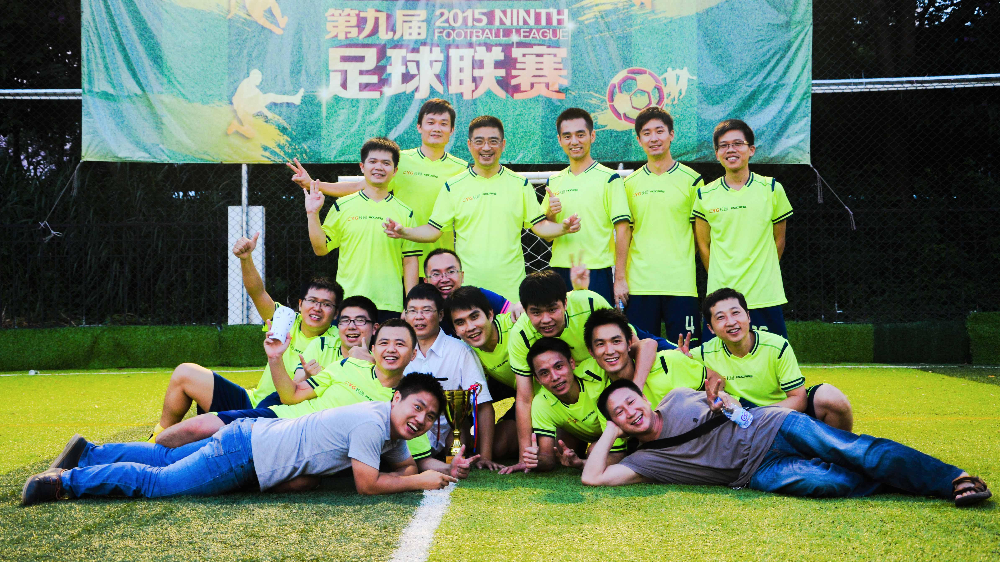

#####王朝诞生

2016年，深瑞足协又迎来了一位霸气风骚的掌门人，邓主席卸任之后，李主席从他手从接过大旗，期待着带领大家走向辉煌。2017年炎热的夏天，李主席上任后第一次率队参加“长园集团第十届足球联赛”，手握前朝余孽众多球星，深瑞军团轻而易举杀入决赛。宿敌终究是宿敌，决赛面对长园电子双方鏖战常规时间八十分钟和加时赛三十分钟均未分胜负，点球大战中凭借门将熊国栋的英勇扑点和罗主席的一锤定音，深瑞军团再次登顶，成功卫冕冠军。

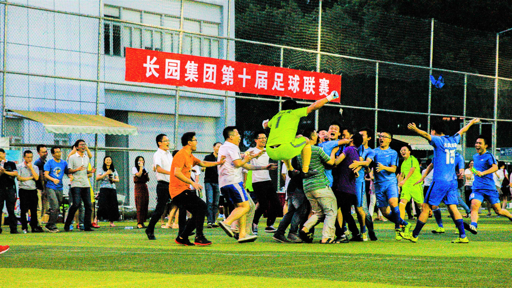

时光荏苒，转眼间又来到了2019年的夏天，“长园集团第十一届足球联赛”再次举行。这一次，深瑞军团加入了新生血液，四处征战，小组赛以三胜一负的战绩取得小组第二出线，半决赛远赴珠海客战长园电力，凭借张晓明的一粒进球险胜对手。深瑞军团以卫冕冠军的身份再一次站在了熟悉的决赛舞台，迎接后起之秀长园长通的挑战。决赛当天身兼领队、教练、队长三权于一身的老蔡因故未能参加比赛，罗主席临时接任队长袖标坐镇后防指点江山。上半场仓老师和小蔡各进一球打开局面，下半场凭借侯总的一传一射奠定胜局，长园深瑞最终以5-0的比分轻松拿下对手，顺利夺得本次联赛冠军，创造了联赛三连冠的伟业。任风云变幻，王朝已然开启，深瑞军团终将一如既往地守护住这份荣耀。

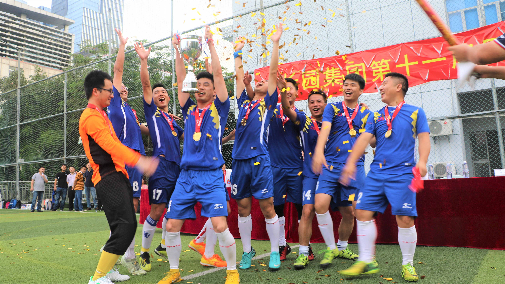

###
妖娆球星

以冠军的名义告别，邓主席终尝所愿，6年，人生能有几个6年；我们经历了这样的时代，而我们即将迎来的是一个全新的时代。从你们爱上足球那一天起，有谁见过，深瑞足协的主席位置上端坐的不是邓主席。

俗话说，创业容易守业难。当深瑞足协已经有了一个伟大的邓主席之后，谁能够想到，他们在接下来的时光里又将迎来一个同样伟大的李主席；当邓主席带领球队拿到久违的联赛冠军奖座之后，谁又能够想到，两年后的李主席同样带队蝉联卫冕冠军；而这一次，李主席率领的深瑞军团一路高歌猛进，势如破竹，创造了联赛三连冠的伟业，开创了一个辉煌的深瑞王朝。

也许，这个世界上有两个罗纳尔多，有三个罗纳尔迪尼奥，但是这个世界上只有一个罗来峰。号称南山德罗巴的罗主席极具风骚，操着一口蹩脚的广东话，脚下假动作层出不穷，总是幻想着自己滑轨能够滑出三道杠。

对于一个视传球如生命的男人来说，足球就像是他的初恋情人。2019年的这个夏天，当仓老师站在长园电力球场传出赛季的个人第一脚助攻时，他获得了全世界的掌声。然而，对于仓老师而言，失去了皮球，就像是失去了他最深爱的恋人。这种忧伤，伴随一生！

作为一名忠实的皇马球迷，张天师完美得继承了齐达内的玄学；曾经的张泽江黄袍加身，叱咤风云，一手遮天，操纵着整一片南山上空的天气，每到周五势必翻江倒海；当齐达内事了拂衣去时，张秘身上的玄学也将慢慢地退出历史舞台。

这是一个天使和魔鬼赋予一身的人，无论在哪里，水涛发帖都意味着晴天，哪怕前一秒都还是风雨交加。讨厌水涛的人可能会有一万个理由，但是爱他的只需要一个理由。佛说道高一尺魔高一丈，如果说泽江是黑色星期五的万恶之源，那么水涛则是上帝派来降伏它的福将。

足协如此多娇，引无数球星竞折腰。南山德罗巴，略输文采；泽江水涛，稍逊风骚。一代天骄，福建C罗，只识粘球射大雕。俱往矣，数风流人物，还看今朝。

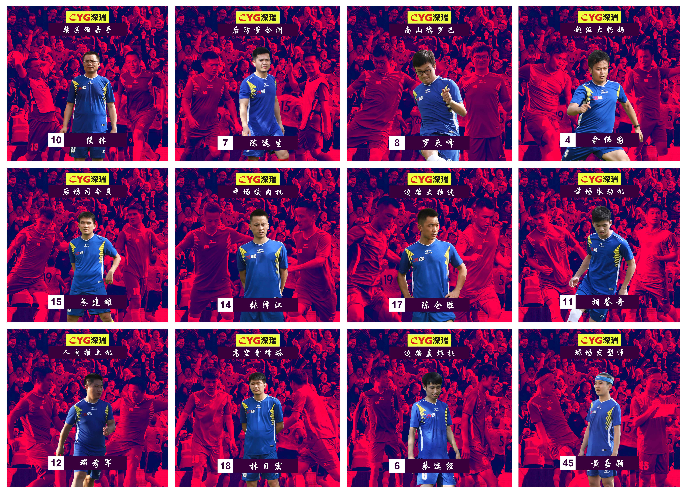